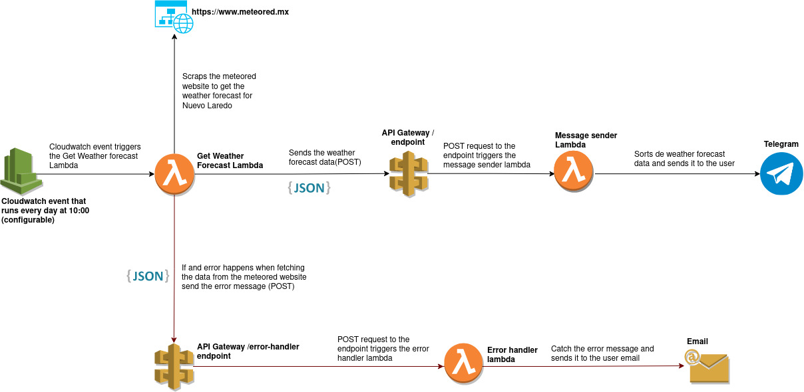
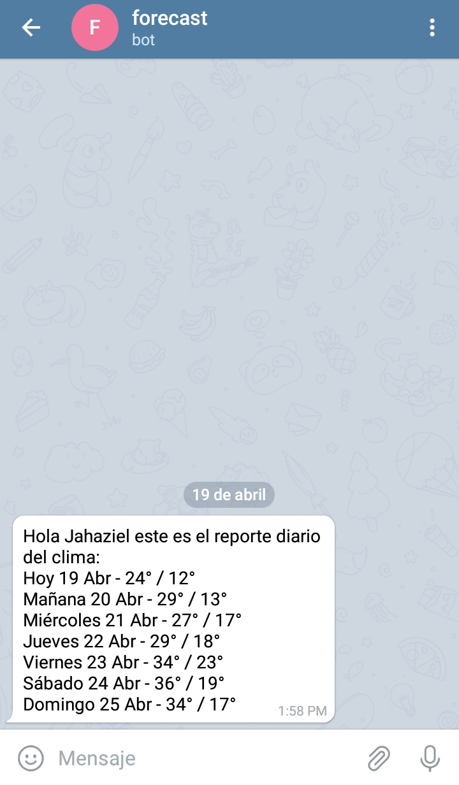

# Forescrapp: serverless bot project

## What is this? Why?
This is a personal project by me with the intentions of learning some concepts of AWS and Cloud Architecture

## Project status
Finished

## Goal/Objectives
Receive a daily weather forecast report from the city of Nuevo Laredo, Tamps, México.

## Definitions and Acronyms
* AWS: Amazon Web Services.
* Lambda: AWS service that lets you run code without provisioning or managing servers.
* API Gateway: AWS service for create RESTful APIs and WebSocket APIs.
* Cloudwatch Event: AWS service that allows you to schedule automated actions at certain times using cron or rate expressions.

## Diagram

## Final result image demo

